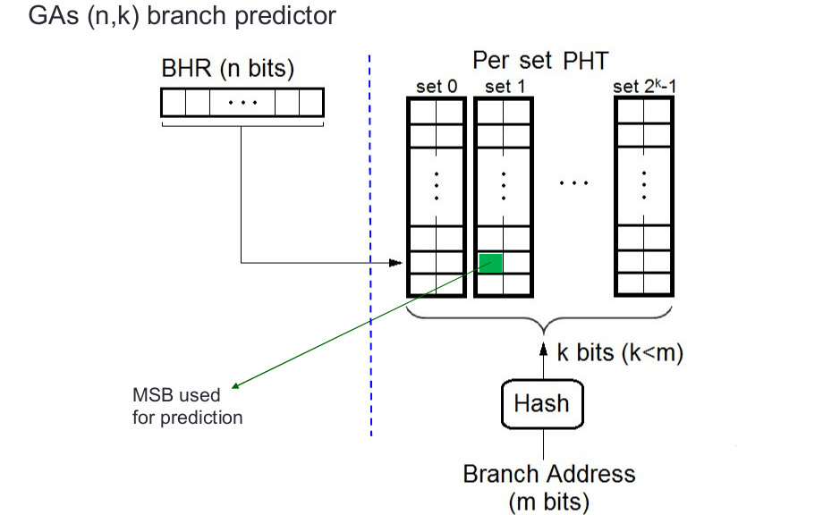

# GAs Predictor 

## How to implement a GAs

1) Use a register as a global branch history
2) Use a Per Address Predication History Table to recognize the branches patterns

### Task 1

predict the branch result based on GAg model

HINT:
1) same as GAg
2) same as GAg
3) concat the branch address (PC) with the BHR to get the cache entry
4) hash the value in step 3
5) read from cache
6) save block into the SC
7) return the MSB of cache block or SC

### Task 2

update the predictor state based on the actual result

HINT :
1) pass the SC register bits to a saturating counter
2) save the updated value into the cache via BHR
3) update the BHR with the actual branch result

